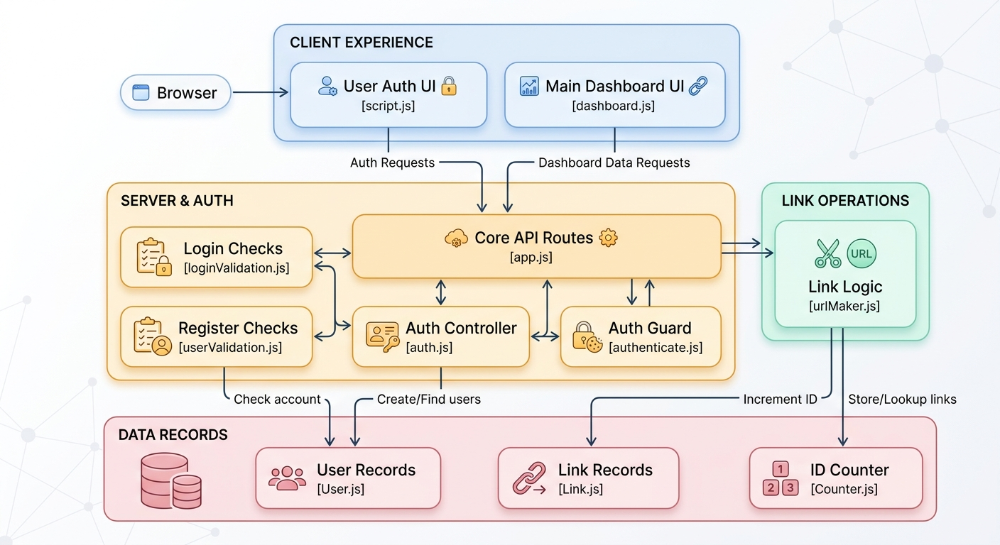

# 🔗 URL Shortener API

> A secure and user-based URL shortening service built with **Node.js, Express.js, MongoDB, and JWT authentication**.

Long URLs can be difficult to share, remember, and manage. This project provides a simple solution by converting long URLs into short, easy-to-share links while allowing authenticated users to manage their own shortened URLs.

---

## 📌 Problem

Long URLs can become difficult to share, especially when they contain lengthy paths, query parameters, tracking information, or other data.

For example:

```text
https://www.example.com/products/software-development/backend/nodejs/expressjs/mongodb/mongoose/authentication/jwt/url-shortener
```

Sharing a URL like this is inconvenient and difficult to remember.

A URL shortener solves this problem by generating a short identifier:

```text
http://localhost:4000/iAb
```

When someone visits the shortened URL, the server finds the original URL and redirects the user to it.

However, this project goes beyond simple URL shortening. It also provides **user authentication and personal URL management**, allowing each user to create and manage their own shortened URLs.

---

## 🎯 Why I Built This

I built this project to understand how a real backend service works beyond basic CRUD operations.

The project focuses on practical backend concepts such as:

- REST API development
- User authentication and authorization
- JWT-based authentication
- Password hashing
- HTTP cookies
- MongoDB and Mongoose
- Protected routes
- Request validation
- Unique URL generation
- HTTP redirection
- Error handling
- Frontend ↔ backend communication

The main goal was to build a small but realistic backend application while strengthening my backend development fundamentals.

---

## 🏗️ System Architecture

<p align="center">
  
</p>

---

## ✨ Features

### 🔐 Authentication

- User registration
- Secure password hashing with bcrypt
- User login
- JWT authentication
- JWT stored in HTTP-only cookies
- Protected routes
- Logout functionality

### 🔗 URL Management

- Convert long URLs into short links
- Generate unique short identifiers
- Redirect short URLs to original URLs
- View user's previously created URLs
- Display URL count
- Copy shortened URLs
- Each user can access their own URL history

### 🛡️ Backend Security

- Authentication middleware
- Protected API endpoints
- Password hashing
- Cookie-based JWT authentication
- Server-side validation
- Unique database constraints

---

## 🧰 Tech Stack

| Technology              | Purpose                |
| ----------------------- | ---------------------- |
| **Node.js**             | JavaScript runtime     |
| **Express.js**          | Backend framework      |
| **MongoDB**             | Database               |
| **Mongoose**            | MongoDB ODM            |
| **JWT**                 | Authentication         |
| **bcrypt**              | Password hashing       |
| **cookie-parser**       | Cookie handling        |
| **express-validator**   | Request validation     |
| **HTML/CSS/JavaScript** | Frontend and dashboard |

---

## 📁 Project Structure

```text
Url_shortner_api/
│
├── controllers/
│   ├── authController.js
│   └── linkController.js
│
├── middleware/
│   ├── authenticate.js
│   └── validation.js
│
├── models/
│   ├── User.js
│   ├── Link.js
│   └── Counter.js
│
├── routes/
│   ├── authRoutes.js
│   └── linkRoutes.js
│
├── public/
│
├── views/
│   ├── login.html
│   ├── register.html
│   └── dashboard.html
│
├── .env
├── .gitignore
├── package.json
└── server.js
```

---

<table>
<tr>
<td width="50%" valign="top">

## 🔐 Authentication

The application uses **JWT-based authentication** with HTTP-only cookies.

### Authentication flow

```text
User
 ↓
Login
 ↓
Validate credentials
 ↓
Generate JWT
 ↓
HTTP-only Cookie
 ↓
Protected Routes
 ↓
Authentication Middleware
```

### Security

- Passwords are hashed using bcrypt.
- JWT is used for authentication.
- Authentication tokens are stored in HTTP-only cookies.
- Protected routes require authentication.
- Backend validation is applied to incoming requests.

</td>

<td width="50%" valign="top">

## 🔗 URL Shortening

Authenticated users can convert long URLs into short, unique links.

### URL flow

```text
Long URL
 ↓
POST /shortner
 ↓
Generate Short ID
 ↓
Save in MongoDB
 ↓
Return Short URL
```

When a user visits the short URL:

```text
GET /:shortLink
 ↓
Find URL in MongoDB
 ↓
Get Original URL
 ↓
HTTP Redirect
```

Each shortened URL is associated with the user who created it.

</td>
</tr>
</table>

---

## 📡 API Overview

<table>
<tr>
<td width="50%" valign="top">

### 🔐 Authentication

| Method | Endpoint    | Description         | Auth |
| ------ | ----------- | ------------------- | ---- |
| `POST` | `/register` | Register a new user | ❌   |
| `POST` | `/login`    | Login user          | ❌   |
| `POST` | `/logout`   | Logout user         | ✅   |
| `GET`  | `/me`       | Get current user    | ✅   |

</td>

<td width="50%" valign="top">

### 🔗 URL Management

| Method | Endpoint      | Description              | Auth |
| ------ | ------------- | ------------------------ | ---- |
| `POST` | `/shortner`   | Create a short URL       | ✅   |
| `GET`  | `/showAll`    | Get user's URLs          | ✅   |
| `GET`  | `/:shortLink` | Redirect to original URL | ❌   |

</td>
</tr>
</table>

### ⚙️ Environment Variables

Create a `.env` file in the project root:

```env
PORT=4000

MONGO_URI=your_mongodb_connection_string

JWT_SECRET=your_jwt_secret
JWT_EXP=1d

COOKIE_NAME=your_cookie_name
COOKIE_SECRET=your_cookie_secret
COOKIE_MAX_AGE=86400000
```

**Never commit your `.env` file to GitHub.**

---

## 🚀 Installation & Setup

### 1. Clone the repository

```bash
git clone https://github.com/Sukanta116/Url_shortner_api.git
```

### 2. Go to the project directory

```bash
cd Url_shortner_api
```

### 3. Install dependencies

```bash
npm install
```

### 4. Configure environment variables

Create a `.env` file and add the required configuration.

### 5. Start the server

```bash
npm start
```

For development:

```bash
npm run dev
```

The application will run on:

```text
http://localhost:4000
```

---

## 🔒 Security Considerations

This project follows several common backend security practices:

- Passwords are never stored as plain text.
- Passwords are hashed using bcrypt.
- JWT authentication protects private routes.
- Authentication tokens are stored in HTTP-only cookies.
- User-specific URLs are queried using the authenticated user's identity.
- Backend validation is used instead of relying only on frontend validation.
- Sensitive environment variables are stored in `.env`.

For production deployment, additional protections such as HTTPS, secure cookies, rate limiting, CORS configuration, and stronger validation would be appropriate.

---

## 🛣️ Future Improvements

- [ ] Custom short URLs
- [ ] URL expiration
- [ ] QR code generation
- [ ] Click analytics
- [ ] Rate limiting
- [ ] API documentation with Swagger/OpenAPI
- [ ] Redis caching
- [ ] Docker deployment
- [ ] HTTPS configuration
- [ ] Password reset
- [ ] Email verification
- [ ] Admin dashboard

---

## 👨‍💻 Author

**Sukanta Majumder**

CSE Student | Backend Development Enthusiast

GitHub: [@Sukanta116](https://github.com/Sukanta116)

---

## ⭐ Support

If you find this project useful or interesting, consider giving the repository a ⭐ on GitHub.
